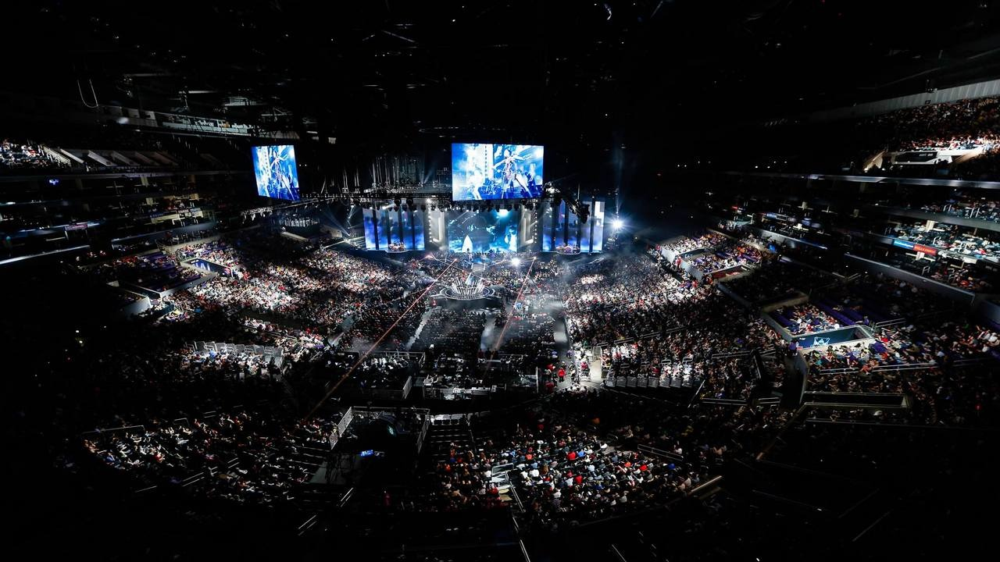

# league-match-time-analysis

# League of Legends Game Time Analysis

**Name(s)**: Chia-Lun Tsao (Gallant)

## Step 1: Introduction

__League of Legends__ (LOL) is a Multiplayer Online Battle Arena (MOBA) game made by Riot games in 2009. In this game, 10 players are divided into 2 teams of 5 each (the blue side and the red side), and pick their respective champions (I will explain what this is later) to try to win the game by defeating the other team. Here is the game map:

As you can see above, there are three lanes where players play their champions on, and the rest of the area of the map is called the jungle. There are 5 traditional roles:

Top Laner (TOP): Normally these are bruisers or tanks who stand in front of a teamfight to provide the necessary space for others to deal damage to the enemy team.

Jungler (JUG): The main roaming character of the game who is responsible for slaying jungle monsters and also controlling the neutral objectives of the game.

Mid Laner (MID): The player in the middle lane who can dictate the pace of the game by reaching out to the jungle, or the top and bottom lane.

Bot Laner (BOT): Normally the hypercarry who is relatively weak earlier but gets progressively stronger as the game goes on and takes over at the late game.

Support (SUP): The helper of the bot lane in the early game. Usually support players are responsible of being the in-game leader as their load is relatively less heavy in terms of being mechanicallly skilled.

The objective of the game is to destroy the opponents' nexus (which are located on the top-right and bottom-left corner respectively). Normally, each game will last around 15-45 minutes depending on how fast the pace of the game is dictated by the teams.

Competitive League of Legends was at its peak a few years ago, and is still one of the most viewed channels on popular stream platforms including YouTube and Twitch. The competitive scene is divided into competitions within the domestic leagues and also the international tournaments (which lots of League players look forward to.

In this project, the question that we are interested in is:

__"Around how long does a League of Legends game take?"__

The designers of League of Legends do not want the average competitive game to last too long, or else people will think it's too boring and not want to watch the game. However, they also will not want the game to be too short, as this wil lead to a one-sided affair every time so the game becomes more predictable and less interesting. Perhaps if there is any significance in the time, this could help them adjust the game accordingly so that more players are willing to join this wonderful community. As such, we are going to conduct on some analysis from League of Legends competitive data.

For this project, we will be mainly focusing on League of Legends competitive data from Season 13 (2023). The dataset contains information about all the professional matches that occured in Season 13 within the competitive scene. Some of its columns include the champions that professional LOL players picked in their games, the result of the game, and certain statistics that are related within the competitive match.

## Step 2: Data Cleaning and Exploratory Data Analysis

### Data Cleaning

First of all, here is the raw dataframe:
| gameid                | datacompleteness   |   url |
|:----------------------|:-------------------|------:|
| ESPORTSTMNT06_2753012 | complete           |   nan |
| ESPORTSTMNT06_2753012 | complete           |   nan |
| ESPORTSTMNT06_2753012 | complete           |   nan |
| ESPORTSTMNT06_2753012 | complete           |   nan |
| ESPORTSTMNT06_2753012 | complete           |   nan |