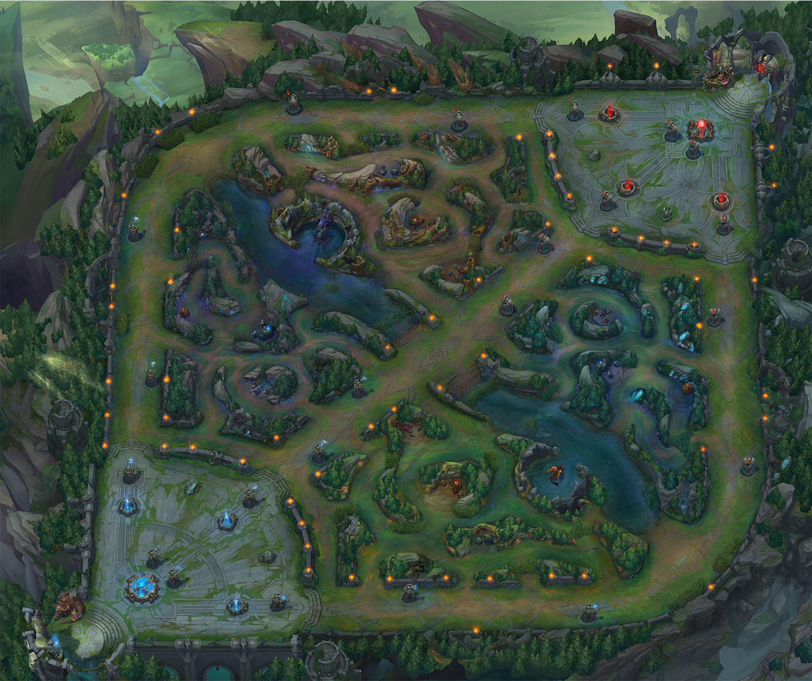

# league-match-time-analysis

# League of Legends Game Time Analysis

**Name(s)**: Chia-Lun Tsao (Gallant)

## Step 1: Introduction

__League of Legends__ (LOL) is a Multiplayer Online Battle Arena (MOBA) game made by Riot games in 2009. In this game, 10 players are divided into 2 teams of 5 each (the blue side and the red side), and pick their respective champions (I will explain what this is later) to try to win the game by defeating the other team. Here is the game map:



As you can see above, there are three lanes where players play their champions on, and the rest of the area of the map is called the jungle. There are 5 traditional roles:

Top Laner (TOP): Normally these are bruisers or tanks who stand in front of a teamfight to provide the necessary space for others to deal damage to the enemy team.

Jungler (JUG): The main roaming character of the game who is responsible for slaying jungle monsters and also controlling the neutral objectives of the game.

Mid Laner (MID): The player in the middle lane who can dictate the pace of the game by reaching out to the jungle, or the top and bottom lane.

Bot Laner (BOT): Normally the hypercarry who is relatively weak earlier but gets progressively stronger as the game goes on and takes over at the late game.

Support (SUP): The helper of the bot lane in the early game. Usually support players are responsible of being the in-game leader as their load is relatively less heavy in terms of being mechanicallly skilled.

The objective of the game is to destroy the opponents' nexus (which are located on the top-right and bottom-left corner respectively). Normally, each game will last around 15-45 minutes depending on how fast the pace of the game is dictated by the teams.


Competitive League of Legends was at its peak a few years ago, and is still one of the most viewed channels on popular stream platforms including YouTube and Twitch. The competitive scene is divided into competitions within the domestic leagues and also the international tournaments (which lots of League players look forward to.

In this project, the question that we are interested in is:

__"Around how long does a League of Legends game take?"__

The designers of League of Legends do not want the average competitive game to last too long, or else people will think it's too boring and not want to watch the game. However, they also will not want the game to be too short, as this wil lead to a one-sided affair every time so the game becomes more predictable and less interesting. Perhaps if there is any significance in the time, this could help them adjust the game accordingly so that more players are willing to join this wonderful community. As such, we are going to conduct on some analysis from League of Legends competitive data.

For this project, we will be mainly focusing on League of Legends competitive data from Season 13 (2023). The dataset contains information about all the professional matches that occured in Season 13 within the competitive scene. Some of its columns include the champions that professional LOL players picked in their games, the result of the game, and certain statistics that are related within the competitive match.

## Step 2: Data Cleaning and Exploratory Data Analysis

### Data Cleaning

First of all, here is the raw dataframe:

| gameid                | datacompleteness   |   url | ...   |   opp_killsat15 |   opp_assistsat15 |   opp_deathsat15 |
|:----------------------|:-------------------|------:|:------|----------------:|------------------:|-----------------:|
| ESPORTSTMNT06_2753012 | complete           |   nan | ...   |               0 |                 0 |                0 |
| ESPORTSTMNT06_2753012 | complete           |   nan | ...   |               0 |                 0 |                0 |
| ESPORTSTMNT06_2753012 | complete           |   nan | ...   |               0 |                 0 |                0 |
| ESPORTSTMNT06_2753012 | complete           |   nan | ...   |               1 |                 0 |                0 |
| ESPORTSTMNT06_2753012 | complete           |   nan | ...   |               0 |                 1 |                0 |

There are a total of 130 columns, which is far more than what we need for our analysis.

Regarding the analysis of our data, we are most interested in the following columns:

`gameid`: The unique identification for the League match, as a string

`gamelength`: The length of the competitive match in seconds, as an integer

`league`: The league (region) that the match took place in

`****at**`: The specific game statistic at xx minutes into the game. For example, `opp_assistsat15` would correspond to the number of assists that the particular opponent has at the 15 minute mark. We won't talk all of this obviously, but chances are that some of it have clear relations.

One important point (which we will get into later) of this dataframe is that each unique professional game is encapsulated in 12 rows: The first five rows consists of player statistics for the blue team, and the next five rows correspond to the player statistics of the red team. The eleventh and twelveth row are just team statistics for the blue and red team respectively. This will also matter as it decides what we can or cannot impute into the dataset when cleaning up this dataframe.

Before we start imputing the missing data, we first extract the useful columns that will be used for our analysis for this part (until the end of hypothesis testing): `gamelength`, `league`, `position`, `champion`, `dpm`, & `damagetakenperminute`.

Here is the first few columns of the dataframe that has the columns that are mentioned above (before we start the cleaning):

| gameid                |   gamelength | league   | position   | champion   |     dpm |   damagetakenperminute |   earnedgold |   result |   goldat15 |
|:----------------------|-------------:|:---------|:-----------|:-----------|--------:|-----------------------:|-------------:|---------:|-----------:|
| ESPORTSTMNT06_2753012 |         2612 | LFL2     | top        | Jax        | 328.093 |                719.541 |        13251 |        1 |       5059 |
| ESPORTSTMNT06_2753012 |         2612 | LFL2     | jng        | Poppy      | 142.856 |                847.305 |         6478 |        1 |       4325 |
| ESPORTSTMNT06_2753012 |         2612 | LFL2     | mid        | Taliyah    | 620.858 |                365.352 |        10118 |        1 |       4956 |
| ESPORTSTMNT06_2753012 |         2612 | LFL2     | bot        | Ezreal     | 964.893 |                398.453 |        11728 |        1 |       5217 |
| ESPORTSTMNT06_2753012 |         2612 | LFL2     | sup        | Karma      | 130.199 |                360.276 |         3212 |        1 |       2827 |

For our dataframe, we will not fill in values for the champion column, as the players are playing the champions, not the teams, so it does not make sense for a team to play a champion. Other than that column, there is not much to do as for the analysis in part 1. Again, we will clean the data in part 2 when we use different columns.

### Univariate Analysis

First of all, let's take a look at how the overall game lengths are distributed across our data. Notice we only need to take every row that is a multiple of twelve because every twelve rows in our dataset represents a unique League of Legends competitive match in 2023.

<iframe
  src="plotly_figs/lengths.html"
  width="800"
  height="600"
  frameborder="0"
></iframe>

The distribution seems to be roughly [log-normal](https://en.wikipedia.org/wiki/Log-normal_distribution) with the peak of the histogram being somewhere arounf the 1800 second mark, which agrees with the average time of a League of Legends game: 30 minutes (even not in the competitive scene).

Next, let's look at the damage taken per minute, but only for junglers. In 2023, a lot of the jungler picks are curated so that they are meant to provide the necessary space for the bot lane players to deal heavy damage. Therefore we would expect them to 'tank' the most damage in a teamfight.

<iframe
  src="plotly_figs/dtpmjg.html"
  width="800"
  height="600"
  frameborder="0"
></iframe>

Again, we see this roughly log-normal pattern appear for the junglers' data. Note that the peak of this histogram is somewhere around the 850-900 mark. Combining this with the above plt about the distributions of game length, we can generate a very rough estimate for the damage taken per minute for all League of Legends professional games in 2023: We have that about 
$$
[850 \cdot 30, 900 \cdot 30] = [25500, 27000]
$$
damage is taken from the jungler in a normal professional match in League of Legends in 2023.

### Bivariate Analysis

Once when I was watching a League of Legends game in China, one of casters was criticizing the bot lane player of the losing team. According to them, the player "was given huge amounts of resources that are sacrificed by his team, yet his impact in team fights were far lower compared to the amount of resources that he got". A natural reasoning when we play League of Legends is that the more amount of gold a player has compared to his opponent, the more damage the player is able to deal throughout the game. Is this actually a reasonable claim? To answer this question, we are going to compare the total amount of gold in the game with the damage per minute, but only for bot laners, as they are the main source of damage threat to the enemy team. Here is the first few rows of the dataframe that we are going to use:

|     dpm |   earnedgold |
|--------:|-------------:|
| 964.893 |        11728 |
| 507.267 |        11219 |
| 714.163 |        14318 |
| 524.163 |        14858 |
| 344.212 |         9219 |

<iframe
  src="plotly_figs/bot.html"
  width="800"
  height="600"
  frameborder="0"
></iframe>

It seems like there is an positive correlation between the amount of gold earned and the dama dealt per minute, which makes sense intuitively: The more gold the player has in the game, the better the items are going to be, so that the champion they choose is able to deal more damage.

Next, let's look at the spread of damage taken per minute across different game roles. Note that we are analyzing this in terms of the individual positions, hence we are getting rid of the rows which contain "team" as their position name. Here is the dataframe we will be using:

| position   |   damagetakenperminute |
|:-----------|-----------------------:|
| top        |                719.541 |
| jng        |                847.305 |
| mid        |                365.352 |
| bot        |                398.453 |
| sup        |                360.276 |

Here is the box and whisker plot for the distributions across positions:

<iframe
  src="plotly_figs/posdmg.html"
  width="800"
  height="600"
  frameborder="0"
></iframe>

From the above, we can observe a few things:
- The variability of the "top" position is larger compared with other positions due to both tanks (roles built to absorb damage) and bruisers (fight less, split push more) being popular throughout the year.
- As expected, the damage taken for bot lane was lower compared with the positions in other lanes.
- Note that for the "support" role, there were some points which are very close to 0, which may be because that the champion _yuumi_ was played. This champion was very special as it will not take damage unless the teammate it is on dies.

### Interesting Aggregates

One interesting group can look at is how much teams like to fight in League of Legends depending on the region. Within the League of Legends community, a few years ago it was commonly said that LCK (Korean) teams like to fight less as they focus more on slowly gaining advantage and LPL (Chinese) teams like skirmishing and fighting more, especially in the early game. So let's group the data from all the major regions and see whether this statement still holds for last year. Again, we're taking every twelveth row as each unique game occupies twelve rows of our data! Here are the first few rows:

| league   |   gamelength |
|:---------|-------------:|
| LPL      |         1836 |
| LPL      |         1779 |
| LPL      |         2692 |
| LPL      |         2762 |
| LPL      |         1529 |

Here is the data after grouping (mean and median):

| league   |   gamelength_mean |   gamelength_median |
|:---------|------------------:|--------------------:|
| LCK      |           1905.18 |              1861.5 |
| LCS      |           1945.75 |              1907.5 |
| LEC      |           1891.53 |              1854   |
| LPL      |           1864.83 |              1834   |

It turns out that both regions, on average, end their game somewhat around the 30-minute mark, different to people expectations. This may be because of the shift in patches which increased the game's tempo so that the professional scene had to adapt to these changes as well, but we cannot be 100% sure.

## Step 3: Assessment of Missingness

To assess the missingness mechanisms, we are going to use the raw dataset. We first rule some of the columns that are missing by design (MD):

`void_grubs`: These void creatures are features of the game that were introduced in 2024, but the people decided to also include this column in the competitive data in 2023. With the void grubs being non-existent in the game in 2023, of course any entries regarding information about them will be empty. Therefore the same missingness mechanism applies to the `opp_void_grubs` column.

`playername`: These are the IDs of the players who are competing in League of Legends tournaments. Because of the way that our data is organized, every eleventh row and twelveth row contain information regarding the whole team, so there will definitely not be the name of the IDs of players. The same will be applied to the `playerid` column.

### NMAR Analysis

Considering the nature of our dataset, I claim that there are no columns are NMAR. Here's the reason why: The data is being collected objectively by certain organizations (for example, the data for professional competitions from China is gathered from the [LPL website](https://lpl.qq.com)), and others from their corresonding regional websites as well. Ignoring the missing columns which are MD that we mentioned earlier, the dataset is objectively stored as data in the League of Legends client, meaning that it is impossible for the missingness of the column to be from the column itself.

For example, some of the columns in `xpat15` is missing. This is not because any player who gained more/less experience in the game are not willing to report their experience level. It's more of an issue with the data collection: Maybe the site storing the match information is no longer active, or perhaps some other reason.

### Missingness Dependencies

Let's look at the `goldat15` column, standing for gold earned by the player (team) at 15 minutes.

```
>>> league_snip['goldat15'].isna().sum()
19992
```

There are clearly entries that are missing. One question we might think about is 'does the `goldat15` column depend on `region`? To answer this question, we have to conduct a permutation test on these columns. As we are dealing with categorical columns, we will be using the total variation distance (TVD) as our test statistic. Here is our observed distribution when `goldat15` is and is not missing: 

| league     |   goldat15_missing=False |   goldat15_missing=True |
|:-----------|-------------------------:|------------------------:|
| AL         |               0.019218   |              0          |
| CBLOL      |               0.0268829  |              0          |
| CBLOLA     |               0.0275494  |              0          |
| CDF        |               0.00755388 |              0          |
| ...        |                     ...  |            ...          |
| UL         |               0.0272162  |              0          |
| VCS        |               0.0404355  |              0          |
| VL         |               0.00977561 |              0          |
| WLDs       |               0.0137747  |              0.00780312 |

We then shuffle the `league` column and conduct the test. Then we plot the data obtained from the simulation into a histogram and also include our test statistic in there.

<iframe
  src="plotly_figs/missing.html"
  width="800"
  height="600"
  frameborder="0"
></iframe>

Our observed statistic is: 0.9915966386554622

Our p-value is: 0.00

Since the p-value is much less than the alpha value of 0.05 that we set in this test (the red vertical line cannot even be seen in this plot), we reject the null in favor of the alternative: That is, it seems like the missingness of the `goldat15` column depends on the `league` column, i.e. `goldat15` columns is NMAR to the column `league`.

We then ask the question: is the missingnesso of `goldat15` dependent on the `result` column? We do the same thing as above. Here is the dataframe we are operating with:

|   result |   goldat15_missing=False |   goldat15_missing=True |
|---------:|-------------------------:|------------------------:|
|        0 |                      0.5 |                  0.5003 |
|        1 |                      0.5 |                  0.4997 |

After doing the permutation test, here is the histogram of the empitical distribution of the TVDs:

<iframe
  src="plotly_figs/missing2.html"
  width="800"
  height="600"
  frameborder="0"
></iframe>

Our observed statistic is: 0.0003001200480191868

Our p-value is: 0.9335

Since the p-value is not less than the significance value of $ \alpha = 0.05 $, we fail to reject the null. It seems like the missingness of `goldat15` is not dependent on `result`.

## Step 4: Hypothesis Testing

[K'Sante](https://www.youtube.com/watch?v=sJupa3WcN88) was a champion that was released on November 3rd of 2022 in League of Legends. He was supposed to be a tank who is the frontline of a teamfight. However, his ultimate ability was able to transform him into a bruiser, which could potentially annihilate the backline of the enemy team in seconds. With this design of having multiple possible classes, this champion was very controversial and had lots of discussion of whether he was too powerful or not. Even professional players like [Showmaker](https://www.reddit.com/r/leagueoflegends/comments/14f9ewr/showmaker_explains_ksante/) was complaining about how the champion was too strong in the game.


Due to his kit, K'Sante appeared frequently in professional play as a great frontliner. Given the style of play in the professional scene of centering around the bottom lane, it may be an interesting question to ask: Do professional games having K'Sante last significantly longer than those games without K'Sante?

To answer this question, let's first set up our null and alternative hypothosis. We have 
$$
H_0: \text{Game lengths having or not having K'Sante are the same,}
$$
$$
H_1: \text{Professional game lengths having K'Sante are longer compared with those not having K'Sante.}
$$

For this test, we will just use the standard threshold of $\alpha = 0.5$ for the test. To do this, we will have to conduct a permutation test on the games which have K'Sante and the ones which don't. To do that, we create a dataframe with another column which tells whether K'Sante is in the list of champions in that game. Here are the first few rows:

| gameid             |   gamelength | champion  | ksante?   |
|:-------------------|-------------:|----------:|----------:|
| 10000-10000_game_1 |         1704 |[Jax, Sejuani, Akali, Kai'Sa, Nautilus, K'Sante, ...]| True      |
| 10000-10000_game_2 |         1809 |[Jax, Maokai, Ryze, Xayah, Rakan, Gragas, ...]| False     |
| 10000-10000_game_3 |         1738 |[Fiora, Sejuani, Gragas, Aphelios, Annie, K'Sante, ...]| True      |
| 10000-10000_game_4 |         1844 |[Aatrox, Wukong, Vex, Zeri, Lulu, Vladimir, ...]| False     |
| 10000-10000_game_5 |         1691 |[Sion, Karthus, Ryze, Xayah, Alistar, Camille, ...]| False     |

In this case, we will use the difference in means as our test statistic, i.e.
$$
t = \text{mean time of games with K'Sante} - \text{mean time of games without K'Sante}
$$
This test statistic is a good choice for our hypothesis as larger values of the statistic indicate that the average time for professional games having K'Sante in them is more than those not including K'Sante. Again, we will do a permutation test here, and here is the histogram of the empirical distribution of the test statistic:

<iframe
  src="plotly_figs/kst.html"
  width="800"
  height="600"
  frameborder="0"
></iframe>

Our observed statistic is: 7.134315024219177

Our p-value is: 0.159

Since this is more than the normal threshold of 0.05, we fail to reject the null, meaning that it seems like game lengths having or not having K'Sante are about the same.

## Step 5: Framing a Prediction Problem